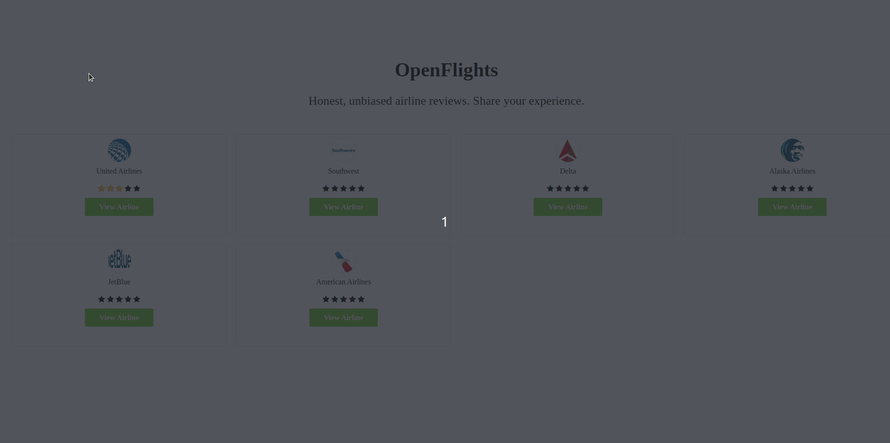

<h1 align="center">
 
  
 
 
  OpenFlights. A review tool for airlines companies
</h1>

A little description about your project

  

-  **Rails** — Backend with crud pratice and REST API
- ⚛️ **React.JS** — A lib that provides front-end

## Getting started

git clone and start:  rails s

## License

This project is licensed under the MIT License - see the [LICENSE](https://opensource.org/licenses/MIT) page for details.
